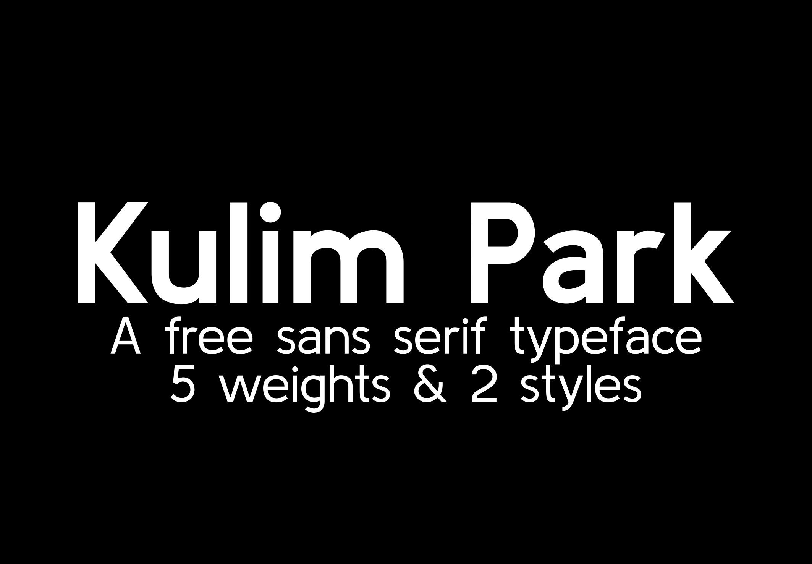

## Kulim Park

Kulim Park is a sans serif typeface, with high x-height, open counter 'a', minimal degrees of contrast in stem width, inviting bowls and a design language aimed at encapsulating openness.

This typeface is the result of an exploration of how a local park redevelopment can inform a typographic design.

### Project documentation
Kulim Park is part of a larger series of site specific typefaces completed as part of a masters project. Further details regarding this typefaces development are available here, [Project overview](docs/project-overview.md).

### Available weights - Each weight is also available in italic
Extra Light  
Light  
Regular  
Semi Bold  
Bold  
 

